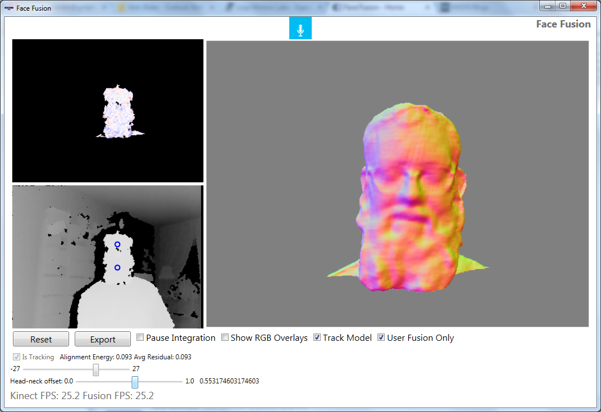

# Face Fusion
Scan your head in 3D simply by turning your head in front of a fixed Kinect for Windows sensor.

# Videos

[Channel 9 - Community Sample: Face Fusion (Design)](http://channel9.msdn.com/Blogs/k4wdev/Community-Sample-Face-Fusion-Design)

[Channel 9 - Community Sample: Face Fusion (Code Walkthrough)](http://channel9.msdn.com/Blogs/k4wdev/Community-Sample-Face-Fusion-Code-Walkthrough)

# Features

Face Fusion is a sample application for the Kinect for Windows SDK that guides you through the process of making a 3D scan of your head. Face Fusion has the following features:

* Uses Kinect Fusion to perform object scanning 
* Automatically tracks and isolates your head from other items in the scene
* Scan by slowly turning your head in view of the sensor
* Does not need a second person to move the sensor around you. 
* Control the application using voice commands
* Audio tone feedback of the scan progress, so you don't need to look at the screen to complete a self-scan.
* Export the finished scan in .obj format for use in other applications.

# Requirements
* Windows 7 or 8
* Kinect for Windows sensor
* Kinect for Windows SDK v1.7 or later
* DirectX 11-compatible GPU
See also [Kinect SDK System Requirements](http://msdn.microsoft.com/en-us/library/hh855359.aspx). In particular, to run Kinect Fusion:

_Kinect Fusion has been tested on the NVidia GeForce GTX560, and the AMD Radeon 6950. These cards, or higher end cards from the same product lines are expected to be able to run at interactive rates._

Kinect Fusion needs to run at approximately 30 FPS to successfully track and scan. It can run on a laptop if the laptop has a decent discrete video card. Unfortunately, **integrated graphics cards such as Intel HD Graphics are too slow to run Kinect Fusion.** 

# Physical setup

Position the sensor near the computer display. For best results, mount the sensor at approximately head height using a stand, tripod, or other mechanism. 

You will need about 6 feet in front of the sensor to move around in.

# How to use

# Plug in the Kinect sensor and run Face Fusion
# Position yourself in front of the Kinect for Windows sensor
# If necessary, move until you see two circles overlaid on your head and neck in the depth image. The circles indicate the application is tracking those joints.
# Say "Fusion Start". This will start the scan process and you will hear the audio tone feedback.
# When the audio tones play a triad chord, the scan has fully integrated the current view of your head. Turn your head until the audio tone slides down a bit, then pause there while the application integrates the data from the new view. As the new view is integrated, the tone will slide upward again until it changes to the triad chord.
# When you want to stop or pause the scan, say "Fusion Pause". The audio tones and scan will stop, when you will see the reconstructed model rotate.
# Click Export to save an .obj file of the scan. 

Tips for scanning:
* Move slowly and let the audio feedback guide you about when to pause and when to move again
* For best results, start a bit farther back so the Kinect can see your skeleton (the circles show up on your head and neck) and then move closer, almost to the near range of Kinect.
* If your shoulders are in the scan, you should try to move your shoulders and head together. Turning your head without your shoulders will result in scan failure.
* Use the head-neck offset slider to adjust the reconstruction volume vertically to get more or less shoulder. 
* For a full head scan, you can turn all the way around (including facing away from the sensor) but you'll need to pause several times along the way.
* If you turn all the way around, the scan may not line up fully. The more careful you are, the better it will line up. You can compensate by rescanning the seam area until it smooths out.
* Don't forget to tilt your head down and up to let the Kinect see the top of your head and under your chin and nose.
* If tracking fails (dissonant chord) it will try to pick you back up at the last location it saw you.

If the scan fails to track your movements (did you move too fast or too far?) the audio tones may switch to a dissonant chord. It will try to recover tracking if possible, but the scan quality may be negatively affected.

If you want to reset the scan, say "Fusion Reset" or click the Reset button.

Theoretically, you can say "Fusion Pause" to pause the scan and then say "Fusion Start" to unpause and continue, but it may be difficult for the scan data to integrate across the gap if you have moved much. 

## Voice commands

Face Fusion responds to the following voice commands:

* **Fusion Start** - Starts or unpauses a scan.
* **Fusion Pause** - Pause the scan and rotate the 3D scan model.
* **Fusion Reset** - Clear the scan and start again.

# Need help?

If you need help, please check [https://facefusion.codeplex.com/](https://facefusion.codeplex.com/) 

# License

The Face Fusion project software is licensed under the MIT license. See [https://facefusion.codeplex.com/license](https://facefusion.codeplex.com/license) for details.

The Microsoft.Kinect.Toolkit.* projects' source code and Kinect Toolkit dll files are are from the Kinect for Windows Developer Toolkit and distributed per the terms of the Kinect SDK EULA: http://www.microsoft.com/en-us/kinectforwindows/develop/sdk-eula.aspx. Original toolkit downloaded from [http://www.microsoft.com/en-us/kinectforwindows/develop/developer-downloads.aspx](http://www.microsoft.com/en-us/kinectforwindows/develop/developer-downloads.aspx). Modifications are commented and dated.

MVVM Light is included under the MIT License. [https://mvvmlight.codeplex.com/](https://mvvmlight.codeplex.com/)

NAudio is included under the Microsoft Public License (Ms-PL). [https://naudio.codeplex.com/](https://naudio.codeplex.com/)

Blake.NUI is available from [https://blakenui.codeplex.com/](https://blakenui.codeplex.com/).